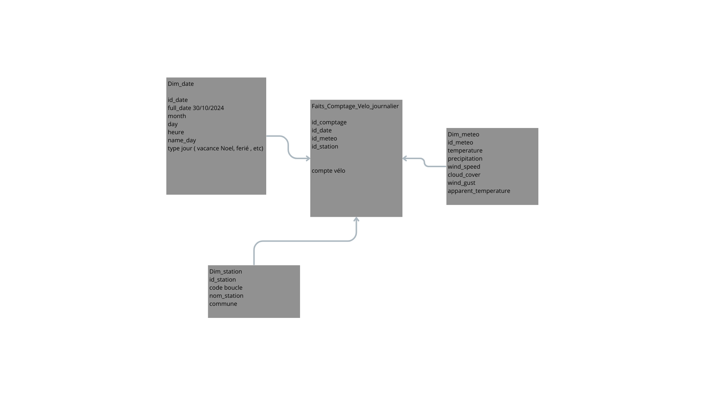
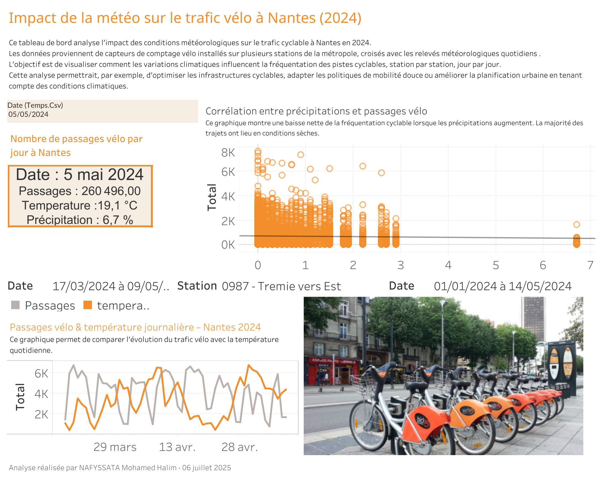

# Analyse des comptages vélo et données météo – Nantes Métropole 2024

Projet de modélisation et d’analyse de données publiques de Nantes Métropole, centré sur l’impact des conditions météorologiques sur l’usage du vélo en 2024.

---

## Objectifs du projet

- Construire un mini entrepôt de données (modèle en étoile) avec PostgreSQL
- Croiser les données de comptage vélo et de météo à l’échelle journalière
- Définir des indicateurs de qualité des données
- Réaliser des analyses exploratoires pour :
  - Identifier les tendances d’usage du vélo
  - Mesurer l’impact de la météo sur la fréquentation
  - Détecter des anomalies dans les données

---

## Sources de données

- Comptages vélo – Nantes Métropole  
  https://data.nantesmetropole.fr/explore/dataset/244400404_comptages-velo-nantes-metropole/

- Données météo 2024 – API Open-Meteo  
  https://open-meteo.com/
  ---

## Période analysée

Du 1er janvier au 31 décembre 2024

---

## Modélisation des données

### Schéma en étoile

- `fait_comptage_velo` : mesures journalières
- `dim_date` : informations temporelles (jour, mois, type de jour, etc.)
- `dim_meteo` : météo quotidienne (température, précipitations, vent)
- `dim_station` : informations et localisation des stations

---

## Analyses exploratoires

- Évolution du trafic vélo par saison et par mois
- Identification des heures de pointe (modèle horaire secondaire)
- Corrélation entre température et nombre de passages
- Impact de la pluie et du vent sur la fréquentation
- Construction d’un indicateur de qualité de données

---

## Visualisation interactive

Un tableau de bord interactif a été réalisé avec Tableau Public.

- [Accéder au tableau de bord](https://public.tableau.com/views/classeurvelonantes/Tableaudebord1?:language=fr-FR&:sid=&:redirect=auth&:display_count=n&:origin=viz_share_link)

---

## Technologies utilisées

- PostgreSQL : modélisation et stockage des données
- DBeaver : interface SQL
- Python (Pandas, SQLAlchemy) : traitement, transformation, appel API météo
- Tableau Public : visualisation des résultats

---

## Compétences mobilisées

- Modélisation de base de données relationnelle
- Nettoyage et transformation de données
- Croisement de jeux de données hétérogènes
- Intégration de données 
- Conception de tableau de bord interactif
- Analyse exploratoire et mise en valeur des données

---

## Auteure

**Nafyssata Mohamed Halim**  
Étudiante en Master Data Science – Nantes Université  
Contact : nafyssata@gmail.com
